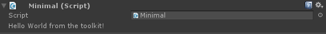
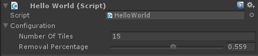
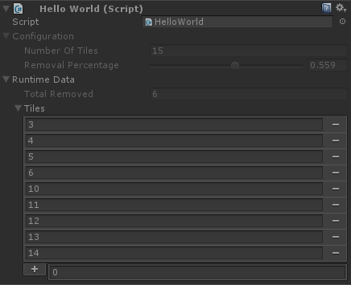

# The ToolKit

The toolkit is designed to make writing entirely custom editors extremely easy. It allows for quick, seamless editor customization to the most powerful degree - with far more flexibility than attribute based customization solutions. You write custom editors directly inside of the object that the editor applies - no more creating editor scripts.

## Example: A Minimal Editor

Here is a minimal example of how to use the toolkit with any type that derives from `MonoBehaviour` or `ScriptableObject` (including `BaseBehavior` and `BaseScriptableObject`).

```c#
using FullInspector;
using UnityEngine;
using tk = FullInspector.tk<Minimal>;

public class Minimal : MonoBehaviour, tkCustomEditor {
    tkControlEditor tkCustomEditor.GetEditor() {
        return new tkControlEditor(
            new tk.Label("Hello World from the toolkit!"));
    }
}
```



Notice the `using tk = FullInspector.tk<Minimal>` statement. This line greatly reduces boilerplate - if we did not have this using statement, then

```c#
new tk.Label("Hello World from the toolkit!"));
```

would expand to

```c#
new tk<Minimal, tkEmptyContext>.Label("Hello World from the toolkit!"));
```

If you're writing a complex editor, this simplification to only `tk` significantly enhances readability.

### Outside of MonoBehaviour

You can also use the toolkit on non-MonoBehaviour types via [fiInspectorOnly](#docs/usage_fiinspectoronly). However, this is currently more experimental and the APIs may change in future releases so that, ie, labels can be displayed.

```c#
using System;
using FullInspector;
using UnityEngine;
using tk = FullInspector.tk<RegularObject>;

[Serializable]
public class RegularObject : fiInspectorOnly, tkCustomEditor {
    tkControlEditor tkCustomEditor.GetEditor() {
        return new tkControlEditor(
            new tk.Label("Hello World from the toolkit!"));
    }
}

public class Minimal : MonoBehaviour {
    public RegularObject obj;
}
```

## Example: Runtime Data

We want to write an editor for this behavior:

```c#
using System.Collections.Generic;
using UnityEngine;

public class HelloWorld : MonoBehaviour {
    public int numberOfTiles;
    public float removalPercentage;

    private HashSet<int> tiles;

    protected void Awake() {
        tiles = new HashSet<int>();
        for (int i = 0; i < numberOfTiles; ++i) tiles.Add(i);

        int removeCount = (int)(removalPercentage * numberOfTiles);
        while (--removeCount > 0) {
            tiles.Remove(Random.Range(0, tiles.Count - 1));
        }
    }
}
```

Looking at the behavior, we notice that there is some configuration data (`numberOfTiles` and `removalPercentage`) and then also some runtime data (`tiles`). When the game starts up, we populate our `tiles` data but then after that we do not touch it.

We have a few requirements for the inspector we want to display:

- Allow the user to easily configure the configuration data
- Prevent config data from being edited in play-mode, as those changes will not be propagated
- Show the runtime data to the user via the inspector

Here is the inspector we will write while we *are not* in play-mode.


and here it is while we *are* in play-mode.


Luckily, with the toolkit this complex inspector is extremely easy to write.

```c#
using System.Collections.Generic;
using FullInspector;
using UnityEngine;
using tk = FullInspector.tk<HelloWorld, FullInspector.tkEmptyContext>;

public class HelloWorld : MonoBehaviour, tkCustomEditor {
    public int numberOfTiles;
    public float removalPercentage;

    private HashSet<int> tiles;

    protected void Awake() {
        tiles = new HashSet<int>();
        for (int i = 0; i < numberOfTiles; ++i) tiles.Add(i);

        int removeCount = (int)(removalPercentage * numberOfTiles);
        while (--removeCount > 0) tiles.Remove(Random.Range(0, tiles.Count - 1));
    }

    tkControlEditor tkCustomEditor.GetEditor() {
        return new tkControlEditor(
            new tk.VerticalGroup {

                // configuration data
                new tk.Foldout("Configuration",
                    new tk.VerticalGroup {
                        new tk.PropertyEditor("numberOfTiles"),
                        new tk.Slider(
                            new fiGUIContent("Removal Percentage"), 
                            /*min*/0, /*max*/1,
                            (o,c) => o.removalPercentage,
                            (o,c,v) => o.removalPercentage = v)
                    }) {
                        // disable configuration data in play-mode 
                        Style = new tk.ReadOnlyIf(o => Application.isPlaying)
                    },

                // play-mode data
                new tk.ShowIf(o => Application.isPlaying, 
                    new tk.Foldout("Runtime Data",
                        new tk.VerticalGroup {
                            tk.PropertyEditor.Create("Total Removed",
                                (o,c) => o.numberOfTiles - o.tiles.Count),
                            new tk.PropertyEditor("tiles"),
                        }))
            }
        );
    }
}
```

First, we have to write `using tk = FullInspector.tk<HelloWorld, FullInspector.tkEmptyContext>` to reduce boilerplate. We could have simplified this statement to `using tk = FullInspector.tk<HelloWorld>` which will use  `tkEmptyContext` for the second generic parameter.

One of the layout items is the following:

```c#
new tk.VerticalGroup { /* ... */ }
```

This means that every `tkControl` inside of the group will at the same x-coordinate but increasing y-coordinates - akin to `GUILayout.BeginVertical`. There is a simpler `tk.HorizontalGroup` which mirrors `GUILayout.BeginHorizontal`.

After that, we have this block:

```c#
// configuration data
new tk.Foldout("Configuration",
    new tk.VerticalGroup {
        new tk.PropertyEditor("numberOfTiles"),
        new tk.Slider(
            new fiGUIContent("Removal Percentage"), 
            /*min*/0, /*max*/1,
            (o,c) => o.removalPercentage,
            (o,c,v) => o.removalPercentage = v)
    }) {
        // disable configuration data in play-mode 
        Style = new tk.ReadOnlyIf(o => Application.isPlaying)
    },
```

We have a foldout for all of the configuration data. The foldout takes a subcontrol, so we just nest all of the subcontrols within a vertical group. After that, we display the number of tiles within a regular property editor but we want to use a slider for the removal percentage parameter.

```c#
new tk.Slider(
    new fiGUIContent("Removal Percentage"), 
    /*min*/0, /*max*/1,
    (o,c) => o.removalPercentage,
    (o,c,v) => o.removalPercentage = v)
```

We use the label `"Removal Percentage"`, along with a min\max values of 0 and 1. We fetch to display in the slider with `(o,c) => o.removalPercentage` and we set the value with `(o,c,v) => o.removalPercentage = v`. Here, `o` has type `HelloWorld` (because of our statement `using tk = FullInspector.tk<HelloWorld>`). `c` has type `tkEmptyContext` and contains extra data that can be used for more advanced editors. Finally `v` contains the updated value for the slider.

Currently `tkCustomEditor` does not support context objects - look at `fiEditorGUI.tkControl` for using `tk`-based editors with context objects.

We also have this strange `Style` parameter which is applied to the foldout, ie,

```c#
new tk.Foldout("Configuration", /* ... */) {
    // disable configuration data in play-mode 
    Style = new tk.ReadOnlyIf(o => Application.isPlaying)
},
```

There are various different styles defined, such as applying a color, but this one will just render the GUI in read-only mode if the given lambda returns true. You can apply multiple styles via the `Styles` parameter (versus `Style` which is just a helper for when you only have one style to apply).

Let's discuss the second layout control now.

```c#
// play-mode data
new tk.ShowIf(o => Application.isPlaying, 
    new tk.Foldout("Runtime Data",
        new tk.VerticalGroup {
            tk.PropertyEditor.Create("Total Removed",
                (o,c) => o.numberOfTiles - o.tiles.Count),
            new tk.PropertyEditor("tiles"),
        }))
```

The `tk.ShowIf` control means that the subcontrol will only be displayed if the lambda `o => Application.isPlaying` returns true - in this case when we are in play-mode.

```c#
tk.PropertyEditor.Create("Total Removed",
    (o,c) => o.numberOfTiles - o.tiles.Count)
```

This will display a property editor of type int (since the return type of the lambda is `int` `Create` uses the inferred generic parameter `int`). The lambda we have given only returns a value - we have no way to set the value, so the property editor is read-only.

Our final property editor, `new tk.PropertyEditor("tiles")`, will simply lookup the member names `tiles` and display it using the standard Full Inspector property editor system.