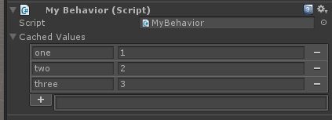
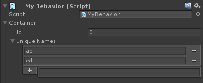

# [fiInspectorOnly]

If you are only interested in having a better inspector without serialization (for example, viewing dictionaries that you create at runtime) then you're in luck! It's extremely easy to use Full Inspector without serialization support.

<important>
These methods do *not* enable support for serialization of generics, interfaces, etc. They merely provide a better inspector.
</important>

## MonoBehaviors / ScriptableObjects

If you have a `MonoBehaviour` that you want to use the Full Inspector inspector on, then it's easy!

Let's say we have this behavior:

```c#
using System.Collections.Generic;
using UnityEngine;

[fiInspectorOnly]
public class MyBehavior : MonoBehaviour {
    public Dictionary<string, string> _cachedValues;
}
```


We can activate *only* the inspector for `MyBehavior` by adding a `[fiInspectorOnly]` annotation, ie,

```c#
using System.Collections.Generic;
using FullInspector;
using UnityEngine;

[fiInspectorOnly]
public class MyBehavior : MonoBehaviour {
    public Dictionary<string, string> _cachedValues;
}
```



## Regular Objects

You can use Full Inspector on a regular objects too. You just have to derive from `fiInspectorOnly`. This does *not* enable any serialization support - only editor integration. If you look at `fiInspectorOnly`, you will see that it is an empty class.

For example, here is how you use it:

```c#
using System;
using System.Collections.Generic;
using FullInspector;
using UnityEngine;

[Serializable]
public class MyContainer : fiInspectorOnly {
    public int id;
    public HashSet<string> uniqueNames;
}

public class MyBehavior : MonoBehaviour {
    public MyContainer container;
}
```



## Serialized Fields

If you have a field that Unity will serialize, then you can use Full Inspector to edit that field. Unfouratntely this technique does not support lists or arrays so it is more limited in scope.

Here's an example:

```c#
public class MyObj {
    [fiInspectorOnly]
    public int myField;
}
```