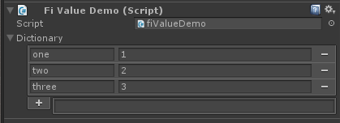

# `fiValue&lt;T&gt;`

`fiValue<T>` enables Full Inspector integration without having to derive from `BaseBehavior`. This allows you to use Full Inspector if you're half-way through a large project or a third-party asset requires that you extend their custom base class.

<important>
`fiValue<T>` only supports Full Serializer, as it is the only serializer which supports serialization within Unity's `ISerializationCallbackReceiver`. Don't worry though - Full Serializer runs everywhere and serializes everything.
</important>

<important>
The derived `fiValue<T>` type cannot currently be used within a namespace - sorry! This is because Unity does not expose namespace information to `serializedObject.type`. You're free to use the derived type however you like, however.
</important>

If you've used `UnityEvent<T>`, then you know how to use `fiValue<T>`. Because Unity doesn't serialize generic types, you just need to derive a new type from `fiValue<T>` and then use that in your class. Here's an example:

```c#
using System;
using System.Collections.Generic;
using FullInspector;
using UnityEngine;

[Serializable]
public class StringIntDictionary : fiValue<Dictionary<string, int>> {}

public class fiValueDemo : MonoBehaviour {
    public StringIntDictionary dictionary;
}
```

Here's how that code shows up in the inspector:


