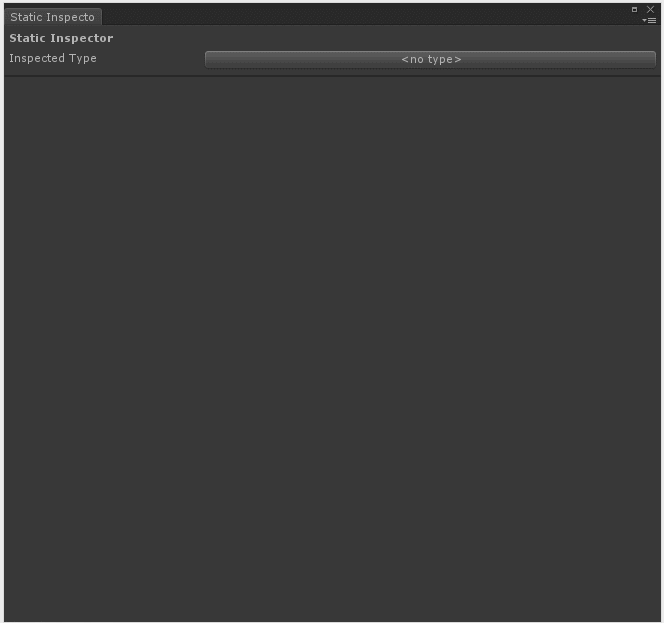

# Static Inspector

The static inspector has been added so that you can interactively view the current values of statics in your game. It also enables you to easily edit the current value of a static variable.

This feature can be a life-saver when trying to view the current value of a static variable without breaking into the debugger or adding lots of print statements.

## Opening

You can open the static inspector with `Alt-I` or `Window\Full Inspector\Static Inspector`.

## Demo 

```c#
using UnityEngine;
using System.Collections.Generic;

public class StaticContainer {
    public static List<GameObject> Singletons;
    public static float RunningTime;
}
```

